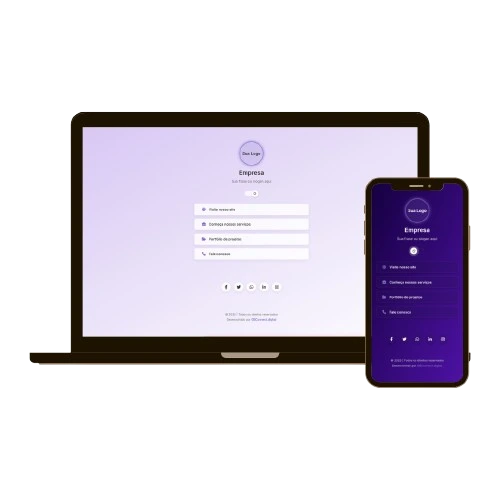

# Cartão de Visita Digital

Um agregador de links moderno, elegante e responsivo para funcionar como cartão de visita digital da sua empresa. Desenvolvido com HTML, CSS e JavaScript puros.
Veja o exemplo em funcionamento:
 [https://gabrielabade.github.io/business-card-example/](https://gabrielabade.github.io/business-card-example/)

## Características

- Design moderno com gradiente roxo
- Tema claro/escuro com alternância automática
- Interface responsiva para dispositivos móveis e desktop
- Animações suaves para melhor experiência do usuário
- Armazenamento local da preferência de tema
- Totalmente personalizável

## Tecnologias Utilizadas

- HTML5
- CSS3 
- JavaScript
- Font Awesome (para ícones)
- Google Fonts (fonte Inter)

## Responsividade
O design se adapta automaticamente a diferentes tamanhos de tela:

- Em dispositivos móveis, o layout é otimizado para telas menores
- Em desktops, o conteúdo é centralizado e com espaçamento adequado